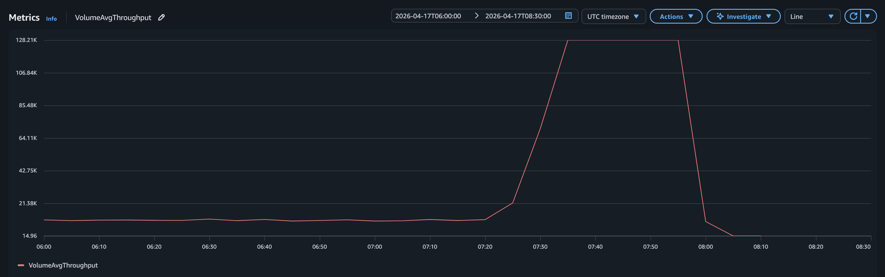
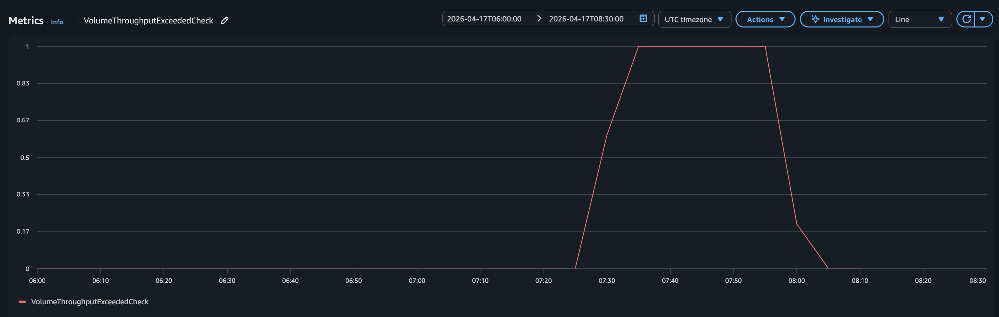
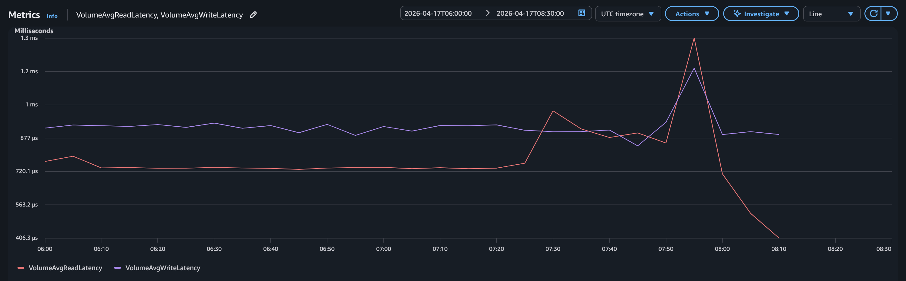

# 2026-04-17 Cha PT Web Application Crash Post Mortem

_Read this in: [한국어](2026-04-17.ko.md)_

_This document is a post-incident review of the April 17, 2026 outage on the ChaPT production system. It is written as a portfolio artifact and is written blamelessly; the author was the incident responder._

ChaPT is a small booking/analytics web application (Go + MySQL) hosted on a single EC2 instance.

## Key Terms

- **EBS** (Elastic Block Store): AWS's network-attached disk service. An EBS volume is the virtual hard drive attached to an EC2 instance — in this case, the single root volume holding the OS, MySQL, and the web server.
- **gp3**: The current general-purpose EBS volume type (solid-state). It delivers a fixed baseline of 125 MiB/s throughput and 3000 IOPS by default; exceeding that baseline triggers throttling unless higher limits are explicitly provisioned.
- **OOM** (Out Of Memory): The condition where a system exhausts its available RAM. Linux responds by invoking the `oom-killer`, which terminates processes to reclaim memory. This was the initial (incorrect) hypothesis for the crash.

## Summary / TL;DR

On April 17, 2026, the ChaPT website was unresponsive for approximately 3 hours between 07:25 and 10:19 UTC. The cause was a set of unoptimized queries issued by the site administrator from an internal analytics dashboard, which saturated the 125 MiB/s throughput ceiling of the instance's gp3 root volume. The resulting I/O starvation cascaded through the OS, producing systemd DBus timeouts, Docker health-check failures, and an unresponsive SSH daemon despite the instance remaining nominally "running". Recovery required provisioning a fresh EC2 instance and reassigning the Elastic IP; no customer data was lost. The incident exposed a set of silent-ceiling monitoring gaps, a shared-volume architecture that lacked blast-radius isolation, and admin tooling that had escaped performance review. Subsequent hardening addressed each.

## Impact

- Duration of outage: 2 hours 54 minutes, from 07:25 UTC to 10:19 UTC
- Number of users affected: approximately 0-5
  - Traffic is low from 03:25 to 06:19 EDT — site visitors are primarily located in NYC
- Revenue impact: $0
  - Given the timing of the outage, it is unlikely a potentially paying customer was attempting to access the website at the time.
- Data impact: none - no DB writes were lost, DB was offline, not corrupted
- Engineering impact: approximately 10 hours total - ~3 hours of recovery and ~7 hours of subsequent root-cause investigation and post-incident review

## Timeline

All times in UTC. The admin who triggered the incident was also the incident responder.

- [2026-02-18 21:28 UTC] Instance boot begins (58-day uptime clock starts)
- [2026-04-17 07:20 UTC] Admin opens internal analytics dashboard
  - MySQL begins a large aggregation query
- [2026-04-17 07:25 UTC] `VolumeThroughputExceededCheck` transitions to 1;
  - gp3 volume throttled to 125 MiB/s
- [2026-04-17 07:25+ UTC] Admin notices public site is unresponsive
- [2026-04-17 07:32 UTC] Admin opens SSH session (successful, but sluggish)
- [2026-04-17 07:42 UTC] SSH session disconnected
- [2026-04-17 07:44 UTC] systemd-logind DBus calls begin timing out
  - Docker health check fails for MySQL container
- [2026-04-17 07:50 UTC] Volume read/write latency spikes
- [2026-04-17 07:55 UTC] Admin initiates reboot via AWS console
  - `VolumeThroughputExceededCheck` returns to 0
- [2026-04-17 07:56 UTC] Force-powered off by AWS after logind DBus fails
- [2026-04-17 07:59 UTC] Instance boots (recovery attempt; healthy for 13 min)
- [2026-04-17 08:13 UTC] Instance stopped for volume rescue
- [2026-04-17 09:33 UTC] Fresh t3.small launched with fresh .env
- [2026-04-17 10:19 UTC] Elastic IP reassigned; service restored

## Root Cause Analysis

**Unoptimized queries issued from an admin dashboard saturated the volume's silent 125 MiB/s throughput ceiling, causing 30 minutes of I/O starvation. Within ~20 minutes of the throttling beginning, cascading userland failures (DBus timeouts, Docker health-check failures, stuck SSH logins) rendered the instance unresponsive.**

- At 07:20 UTC on April 17, the site administrator opened the internal analytics dashboard.
- The page issued one or more aggregation queries (`GROUP BY`, `COUNT`, time-bucketing) against the analytics tables (visitors, sessions, and page-view records totalling tens of thousands of rows, accumulated over 58 days of uptime).
- The queries triggered a sustained read load that, within 5 minutes, saturated the 125 MiB/s default throughput ceiling of the instance's gp3 root volume.
- The volume was throttled; I/O queue depth climbed; within 20 minutes, systemd-logind DBus calls, Docker health checks, and new SSH connections were all timing out.
- The instance remained in the "running" state with passing EC2 instance status checks, but was effectively unresponsive to users.
- Service was restored approximately 3 hours later by provisioning a fresh instance and reassigning the Elastic IP.

_Volume average throughput — sustained at the 125 MiB/s gp3 ceiling from ~07:25 UTC onward._

_`VolumeThroughputExceededCheck` — the single clearest signal of the incident, transitioning from 0 to 1 at 07:25 UTC and remaining asserted until reboot._

_Volume read/write latency spiking as queue depth climbs under sustained throttling — the downstream effect that cascaded into DBus, Docker, and SSH failures._

### Contributing Factors

- gp3 volume using unmonitored default throughput (125 MiB/s) cap which provided no warning before abrupt throttling
- Single-volume architecture — MySQL, Go web server, and OS sharing a single 8 GB root volume — meant a slow query can block the entire system
- No log rotation or query-time monitoring
- No alarms on `VolumeThroughputExceededCheck`, CPU, or instance status
- CloudWatch agent not installed - memory and disk-space visibility absent
- Analytics dashboard issued unindexed, unpaginated aggregation queries
- Long uptime (58 days) allowed tables to grow past scannable threshold without triggering periodic load testing

### Factors Impeding Speedy Diagnosis

- Initial hypothesis was OOM - ruled out only after grepping the crash boot's systemd journal for `oom-killer` and finding zero hits
- CloudWatch had no memory or disk metrics because the CloudWatch agent was not installed
- EC2 instance status checks passed throughout, masking severity
- I/O starvation manifests as silent slowness, not visible errors - unfamiliar pattern

## Resolution

- Recovery proceeded in two phases.
  1. First, the dead instance's root volume was snapshotted (preserving forensic evidence) and detached.
  2. Second, a fresh t3.small instance was provisioned in the same availability zone, configured with Docker and Docker Compose, and the application stack redeployed via `git clone && docker compose up -d` with a fresh `.env` file. The existing Elastic IP was reassociated to the new instance, restoring service without DNS changes.
- No customer data was lost — analytics records accumulated prior to the incident were not critical and were not restored.
- The new instance was initially provisioned as a t3.small during acute recovery but subsequently downsized back to t3.micro after analysis confirmed the incident was not RAM- or CPU-bound. MySQL memory settings were tuned for the 1 GB instance size. Subsequent hardening work addressed the underlying gp3 throughput exposure.

## What Went Well

- Elastic IP enabled seamless transitioning between EC2 instances. No DNS zone file changes were required for recovery.
- EBS snapshot of the dead volume preserved forensic evidence without blocking recovery work.
- Docker Compose made application redeployment on the new instance much easier.
- Systemd journal on the dead volume was fully intact, enabling accurate post-incident reconstruction of the cascade.
- `VolumeThroughputExceededCheck` metric existed in CloudWatch, so once I knew what to look for, AWS had already recorded the evidence.

## What Went Poorly

- No pre-incident monitoring on the critical metric. `VolumeThroughputExceededCheck` gives you direct notification of throughput saturation, but it was never alarmed on. Pre-incident monitoring would have made diagnosis much faster.
- No backups existed. If the dead volume had been unrecoverable, I would have lost 58 days of analytics data.
- Diagnosis chased the wrong hypothesis first. Spent ~30 minutes on OOM theories before the journal evidence (no `oom-killer` entries) redirected me to I/O starvation.
- No runbook existed. Every recovery step was improvised. A documented procedure would have been 3× faster and lower-risk.
- Admin tooling received no performance review. The analytics page was never load-tested at realistic data volumes, so it silently transitioned from "safe" to "dangerous" as the tables grew.
- All services colocated on one 8 GB root volume. A slow query in any one thing could — and did — starve all the others.

## Action Items

| #   | Action                                                                                                                              | Priority | Status |
| --- | ----------------------------------------------------------------------------------------------------------------------------------- | -------- | ------ |
| 1   | Add CloudWatch alarms: `StatusCheckFailed`, `VolumeThroughputExceededCheck` >= 1, `CPUUtilization` > 80% (10 min)                   | P0       | ✅     |
| 2   | Set MySQL `MAX_EXECUTION_TIME` session default to 30s to cap long-running queries                                                   | P0       | ✅     |
| 3   | `EXPLAIN` the analytics dashboard queries; add any missing indexes                                                                  | P0       | ✅     |
| 4   | Tune MySQL for 1 GB instance size: `innodb_buffer_pool_size=256M`, `max_connections=50`, `performance_schema=OFF`                   | P0       | ✅     |
| 5   | Install CloudWatch agent for memory and disk-utilization metrics                                                                    | P1       | ✅     |
| 6   | Configure Docker daemon log rotation (`max-size 10m`, `max-file 3`) — preventive hygiene; addresses adjacent disk-fill failure mode | P2       | ✅     |

### Future Improvements (not addressed in this incident's scope)

Longer-term hardening work that was identified but not executed as part of immediate post-incident response:

| #   | Improvement                                                                                                                                                                                                                                                                                                          | Status |
| --- | -------------------------------------------------------------------------------------------------------------------------------------------------------------------------------------------------------------------------------------------------------------------------------------------------------------------- | ------ |
| 1   | Migrate MySQL to a managed service (Amazon RDS) to isolate database I/O from application and OS I/O on the EC2 instance                                                                                                                                                                                              |        |
| 2   | Capture infrastructure in Terraform to make recovery from instance loss a single-command operation                                                                                                                                                                                                                   |        |
| 3   | Write a disaster-recovery runbook documenting the full recovery procedure used in this incident                                                                                                                                                                                                                      |        |
| 4   | Implement external synthetic health monitoring (e.g., UptimeRobot, Pingdom) to alert on user-visible outages independent of instance health                                                                                                                                                                          |        |
| 5   | Precompute analytics summary tables via scheduled job to remove full-table scans from dashboard render path                                                                                                                                                                                                          |        |
| 6   | Automate daily MySQL backups to S3 with 30-day retention                                                                                                                                                                                                                                                             |        |
| 7   | Convert the `chapt-web` Dockerfile to a multi-stage build with a minimal runtime base (`distroless/static` or `alpine`), reducing the image from ~1 GB to ~30 MB. Reduces EBS pressure on the 8 GB root volume and speeds up redeploys — pairs with log rotation (#6) and image pruning as ongoing disk-hygiene work | ✅     |

## Lessons Learned

1. **gp3 ceilings are silent.**
   - gp3 fixes gp2's burst-credit failure mode but introduces its own invisible throughput (125 MiB/s) and IOPS (3000) ceilings.
   - No default alarm fires when you approach them.
   - Any I/O-sensitive workload on default gp3 needs either provisioned higher limits or explicit monitoring on `*ExceededCheck` metrics.

2. **Internal tools are production.**
   - The analytics dashboard was "just for me," so it received none of the performance scrutiny applied to user-facing routes.
   - But because it shared the same database, disk, and instance as production, a slow admin query was indistinguishable from a slow user query.
   - Admin tools need the same standards as public surfaces.

3. **Long uptimes hide slow growth.**
   - A query safe at week 1 can become fatal at week 8.
   - Without periodic load testing or query auditing, the transition is invisible until it isn't.

4. **Infrastructure "healthy" ≠ application healthy.**
   - EC2 instance status checks passed the entire incident.
   - Only metrics that crossed the app/infra boundary (`VolumeThroughputExceededCheck`) captured reality.
   - External synthetic monitoring is non-negotiable.

5. **Recovery time is a design parameter.**
   - The absence of a runbook and infrastructure-as-code turned a 5-minute problem into a multi-hour one.
   - Recovery capability must be designed explicitly, not assumed.

## Conclusion

This incident was ultimately caused by a single click on an unreviewed admin page. That fragility — that any one person's routine action could saturate the entire production system — was the real finding. The specific fix (raise gp3 throughput, optimize the query) addresses the symptom; the systemic fix (isolate blast radius, monitor ceilings, treat admin tooling as production) addresses the cause.
